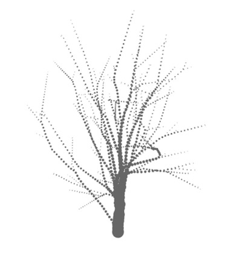

# space-colonization

Algorithm for tree-like and bush-like objects. Based on this [paper](http://algorithmicbotany.org/papers/colonization.egwnp2007.large.pdf).

## Usage

`$ npm i -S space-colonization`

### iterate = space-colonization(opts)
Options:
* `buds`: array of buds position in the format [x, y, z]. This is where your tree is going to grow from
* `hormones`: array of hormones (aka attractors) in the format [x, y, z]. Read the paper for more info on what they are. But simply put, they attract the branch to grow towards them. Can be randomly generated, for more sophisticated type of trees you can generate points inside a crown-like shape. More examples on how to do this will be added soon.
* `deadZone`: the radius of which hormones are killed after each iteration. read the paper for more info. defaults to `0.1`
* `growthStep`: how far a branch can jump on each iteration. defaults to `0.3`
* `splitChance`: how likely it is to split on each iteration. defaults to `0.4`
* `viewAngle`: the angle at which an alive bud (the tip of a growing branch) can see hormones. defaults to `30` (measured in degrees)
* `viewDistance`: how far the alive bud can see hormones. defaults to `0.5`
* `branchAngle`: when a split happens, how far the two new branches bend away from each other. defaults to `30` (measured in degrees)

These numbers (except the angles) assume the buds and hormones have a distance between them in the same range (e.g. from 0 to 5). If you provide positions that have a range of 10-50 for example nothing will grow because the `viewDistance` is too small for the initial bud to see anything!

When you call the above function you get back an iterate function. This function can be called every frame to grow the tree until all hormones are dead or all buds die before they eat all possible hormones. The result of each call is an object with two properties:
* `buds`: an array of buds with each bud an object with properties:
  - `state`: `0` for alive, `1` for dead
  - `position`: [x, y, z]
  - `parentIndex`: the index of the parent bud in the buds array. `-1` if no parent
* `hormones`: an array of hormones with each hormone an object with two properties:
  - `state`: `0` for alive, `1` for dead
  - `position`: [x, y, z]

More info and examples will be coming soon. Post an issue if anything is unclear. See example.js for basic usage with [regl](https://github.com/regl-project/regl/).

## License
MIT
